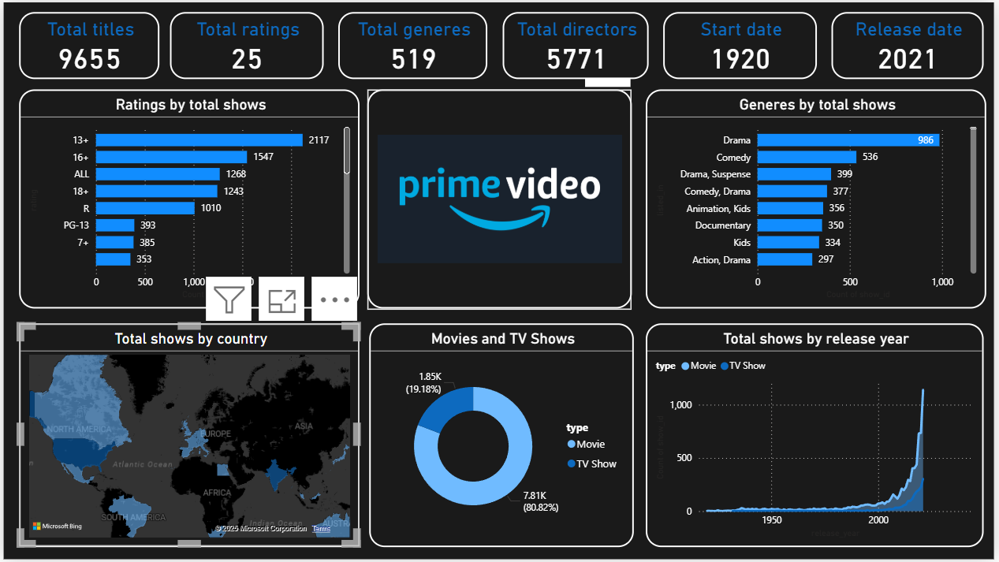

# 📊 Amazon Prime Video Dashboard - Power BI

## 📌 Project Overview
This Power BI dashboard provides a comprehensive analysis of Amazon Prime Video’s content library, covering key statistics such as ratings, genres, countries, and release trends.  
It allows viewers to explore patterns in the platform's content distribution from 1920 to 2021.

## 🛠 Tools Used
- **Power BI** – For building the interactive dashboard
- **Microsoft Bing Maps** – For geographic visualizations
- **Dataset** – Amazon Prime Video content dataset (source: [add source link if public])

## 📊 Key Metrics Displayed
- **Total Titles**: 9,655
- **Total Ratings**: 25
- **Total Genres**: 519
- **Total Directors**: 5,771
- **Content Start Date**: 1920
- **Latest Release Year**: 2021

## 📈 Dashboard Features
- **Ratings by Total Shows** – Age group distribution (e.g., 13+, 16+, 18+, etc.)
- **Genres by Total Shows** – Top genres like Drama, Comedy, and Suspense
- **Total Shows by Country** – Map showing top content-producing countries
- **Movies vs TV Shows** – Proportion of movies and series
- **Release Year Trends** – Growth in content production over the years

## 📸 Dashboard Preview

## 🔍 Insights
- **Drama** is the most popular genre with 986 titles, followed by Comedy (536).
- Most content is targeted at **13+ and 16+** audiences.
- The US and India lead in content production.
- Significant growth in releases after 2010.

---

📢 *This project is part of my Data Analytics portfolio and demonstrates my skills in data visualization using Power BI.*
